# Turkish Feast

(Developed by Oğuzhan Akça)

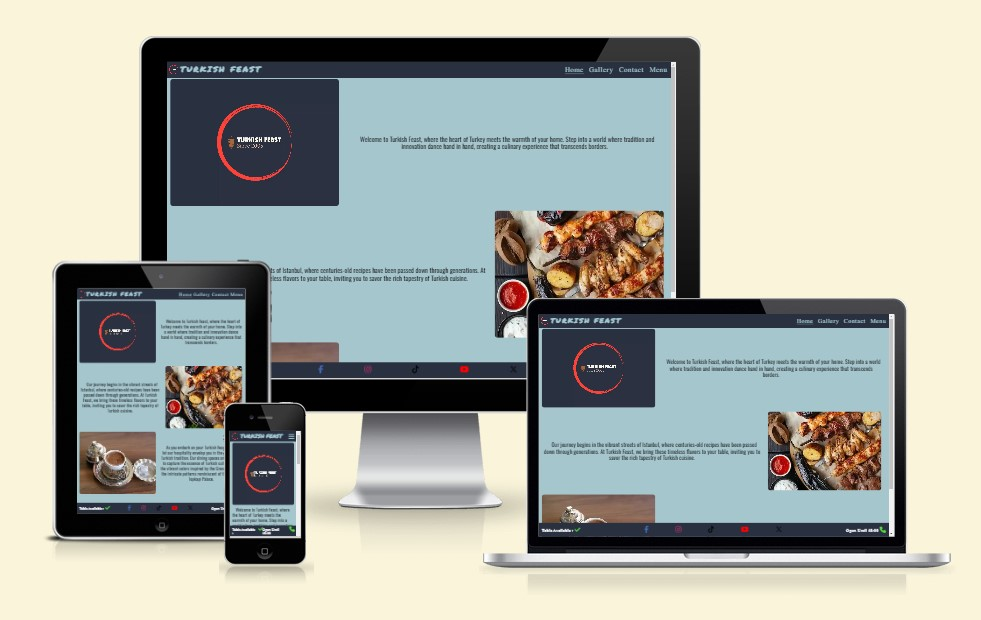

[Live Webpage](https://oguzhanakca.github.io/pp1-restaurant/)

## Table of Content

1. [Project Goals](#project-goals)
   1. [User Goals](#user-goals)
   2. [Site Owner Goals](#site-owner-goals)
2. [User Experience](#user-experience)
   1. [Target Audience](#target-audience)
   2. [User Requrements and Expectations](#user-requrements-and-expectations)
   3. [User Stories](#user-stories)
3. [Design](#design)
   1. [Design Choices](#design-choices)
   2. [Colour](#colours)
   3. [Fonts](#fonts)
   4. [Structure](#structure)
   5. [Wireframes](#wireframes)
4. [Technologies Used](#technologies-used)
   1. [Languages](#languages)
   2. [Frameworks & Tools](#frameworks-&-tools)
5. [Features](#features)
6. [Testing](#validation)
   1. [HTML Validation](#HTML-validation)
   2. [CSS Validation](#CSS-validation)
   3. [Accessibility](#accessibility)
   4. [Performance](#performance)
   5. [Device testing](#performing-tests-on-various-devices)
   6. [Browser compatibility](#browser-compatability)
   7. [Testing user stories](#testing-user-stories)
7. [Bugs](#Bugs)
8. [Deployment](#deployment)
9. [Credits](#credits)
10. [Acknowledgements](#acknowledgements)

## Project Goals

### User Goals

- Finding a restaurant that offers good food and nice atmosphere.
- Find information about the restaurant.
- Find the menu with prices.
- Find location and contact address of the restaurant.
- Check if there is table available for reservation.

### Site Owner Goals

- Promote the business.
- Increase the number of customers and profit.
- Provide information for new and existing customers by requiring fewer contact with business.
- Provide information about business.
- Provide contact address of business.

## User Experience

### Target Audience

- People who wants to taste Turkish cuisine.
- People looking for a place to have dinner.
- People looking to order take away.
- People looking for a place to organize an event.

### User Requirements and Expectations

- A simple and easy to understand navigation system.
- Quick and easy to find relevant information.
- Links that work as they should.
- A responsive and appealing design that can be viewed by any device.
- Finding sufficient information without requiring to contact the business.
- An easy way to contact the business
- Design and content that will not tire the reader's eyes.
- Accessibility

### User Stories

#### First-time User

As a first time user,

1. I want to know more about restaurant.
2. I want to know the menu and prices.
3. I want to be prepared what to expect at the restaurant.
4. I want to know where the restaurant located.
5. I want to know the contact address of restaurant.

#### Returning User

As a returning user,

6.  I want to see the menu.
7.  I want to know the working hours of the restaurant.
8.  I want to find information if reservation is available.
9.  I want to find information if restaurant is open in that moment.
10. I want to find a contact number to call for reservation.
11. I want to find the social media accounts of restaurant.
12. I want to find location of restaurant.
13. I want to leave suggestion or message to the staff.

#### Site Owner

As the site owner,

14. I want the users to find information to contact us.
15. I want users to find enough information if today reservation is available or not, before they contact us.
16. I want users to see our menu.
17. I want users to see photos of events that we made in our restaurant.

## Design

### Design Choices

The webpage was designed to show customers what they can expect in the restaurant. It is calm, inviting and easy on the eyes.

### Colour

For the color theme, I used restaurant's background color as the reference. After some research I decided to use the Mysts of Dawn Color Palette which fits pretty good with restaurant's logo.
 

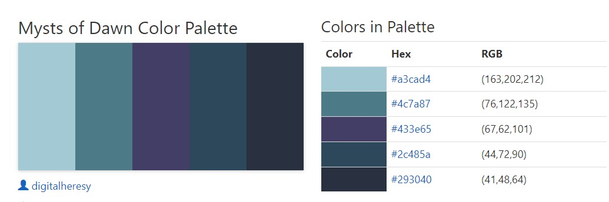

### Fonts

- Restaurant logo : Permanent Marker
- Navigation : Lato
- Main page content : Oswald
- 404 page : Lobster and Lemon

### Structure

The page is structured in a user friendly way and easy to learn.
The header with restaurant logo and navigation will make it easier for users to navigate the website easily.
The footer will provide real-time information about the restaurant and contains social media links.
The website consists of 4 separate pages:

- A homepage with information of restaurant and its products.
- An image gallery with images showcasing the events that made in restaurant and the general feel of the restaurant.
- A contact page with contact information,map,work hours and a contact form.
- A menu page that shows current available menu of restaurant.

### Wireframes

Home

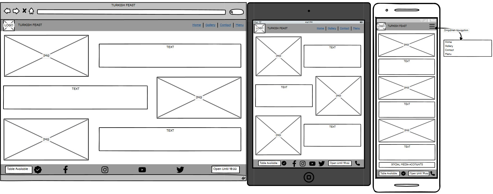

Gallery

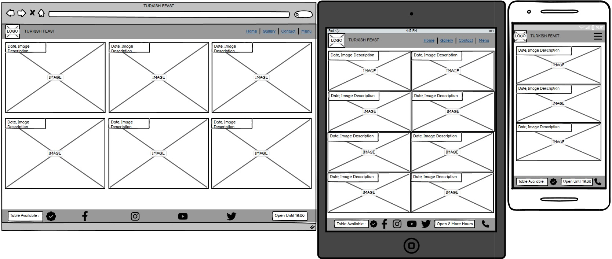

Contact

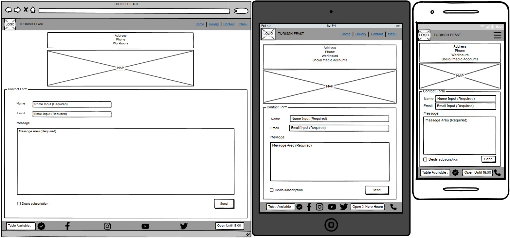

Menu

## Technologies Used

### Languages

- HTML
- CSS

### Frameworks & Tools

- Git
- GitHub
- Tinypng.com
- Balsamiq Wireframes
- Google Fonts
- Color-Hex.com
- Font Awesome
- Favicon.io

## Features

### Logo and Navigation Bar

- Featured on every page
- The navigation bar is fully responsive on different screen sizes. On mobile screen sizes, it changes to a dropdown and includes links to pages
- It allows users to easily navigate the page
- Current page shows with an underline on navigation bar

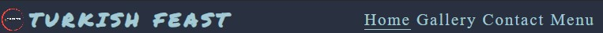

### Homepage

- Gives information about the restaurant and what cuisine they serve
- User stories covered: 1, 17

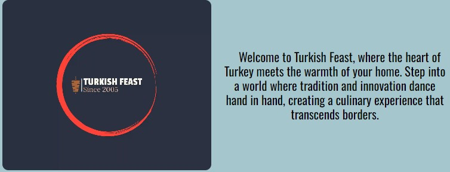

### Footer

- Featured on every page
- Gives information about current capacity of restaurant and its state
- On tablet and bigger screens contains social media links
- Contains a shortcut to make a call
- User stories covered: 7, 8, 9, 10, 11, 15

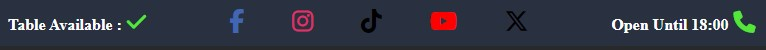

### Image Gallery

- Imagery of the restaurant and the events they hosted
- User stories covered: 1, 3, 17

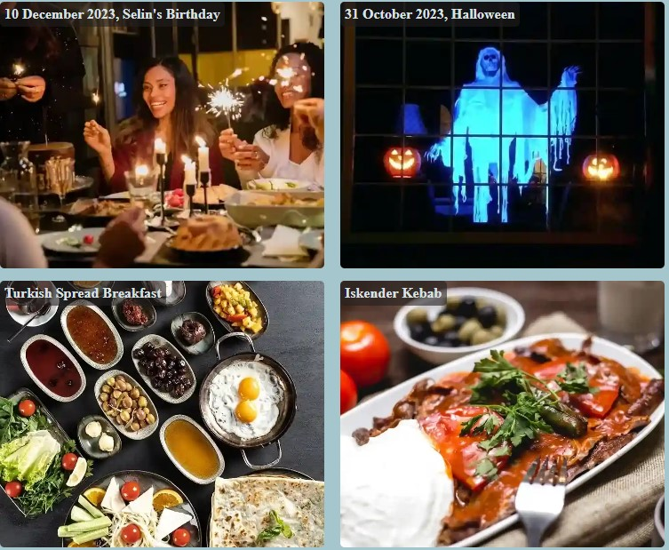

### Contact Form

- A way for user to provide feedback
- Has an option to subscribe for deals & events
- User stories covered: 13, 14

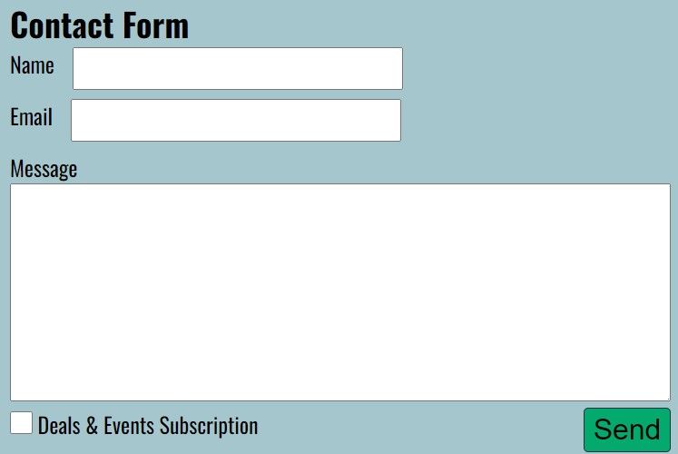

### Map

- Shows the restaurant location on an embeded Google Map
- User stories covered: 4, 12

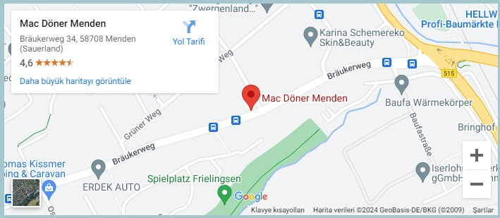

### Contact Information

- Provides the user with information about the restaurant including address, phone number and work hours
- User stories covered: 5, 10, 11, 12, 14

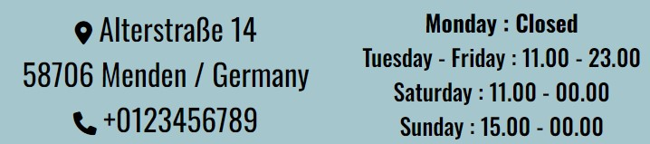

### Menu

- Shows the menu with its own navigation: soups & salads, main courses, seafood, desserts and drinks
- Every meal has its own photo, price and description
- User stories covered: 2, 6, 16

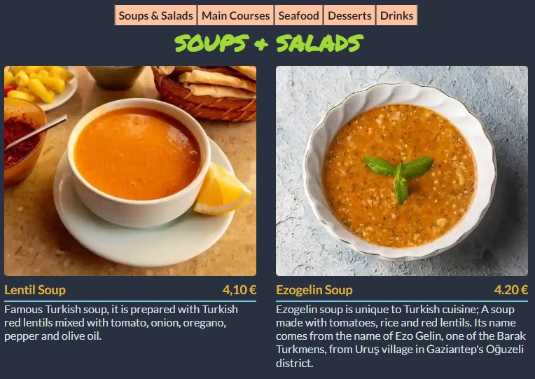

## Validation

### HTML Validation

The W3C Markup Validation Service was used to validate the HTML of the website. All pages pass with no errors no warnings to show.

Home

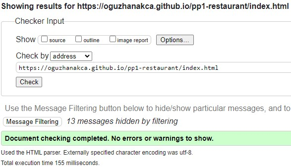

Gallery

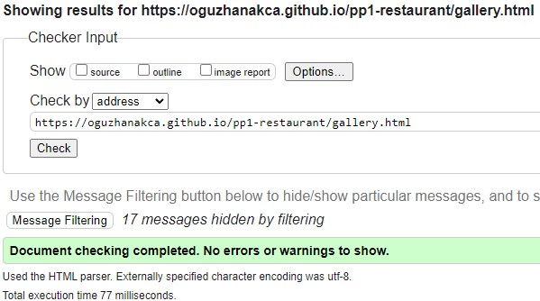

Contact

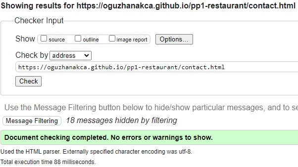

Menu

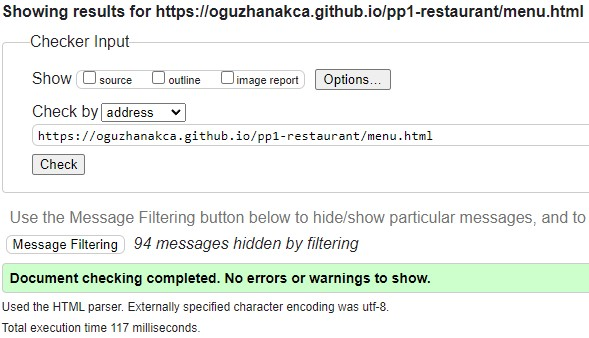

### CSS Validation

The W3C Jigsaw CSS Validation Service was used to validate the CSS of the website.

style.css

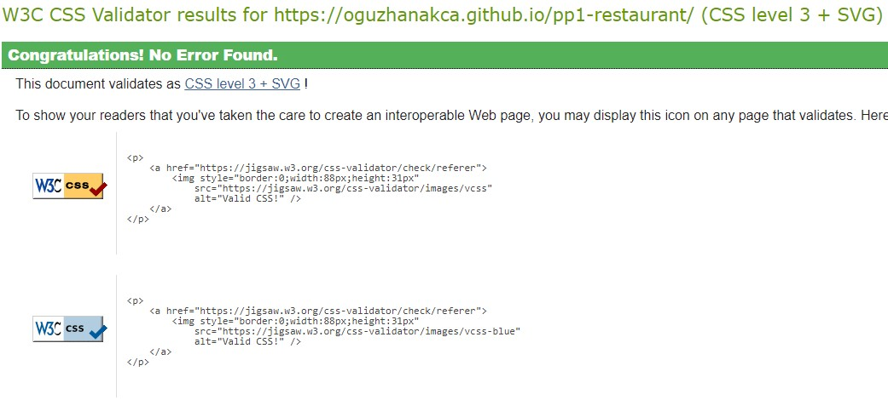

### Accessibility

The WAVE WebAIM web accessibility evaluation tool was used to ensure the website met high accessibility standards. All pages pass with 0 errors.

Home

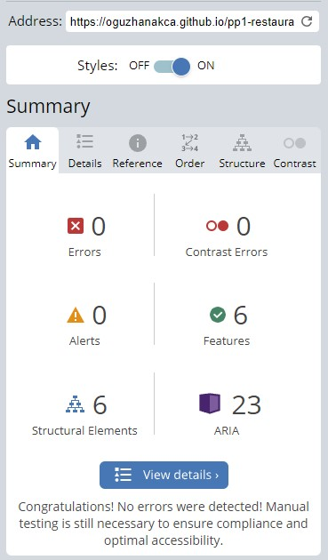

Gallery

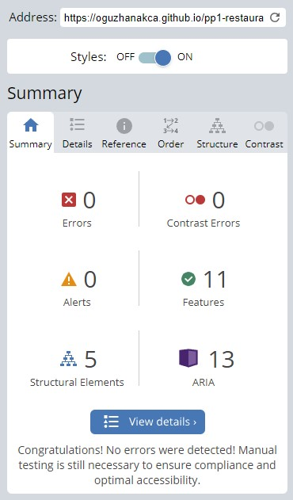

Contact

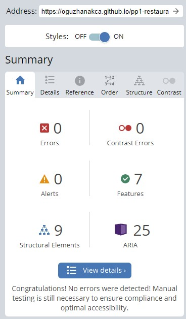

Menu

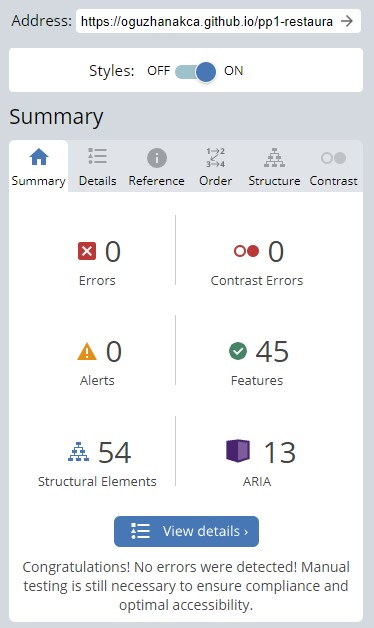

### Performance

Google Lighthouse in Google Chrome Developer Tools was used to test the performance of the website.

#### Mobile

Home

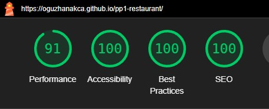

Gallery

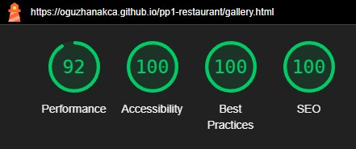

Contact

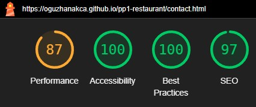

Menu

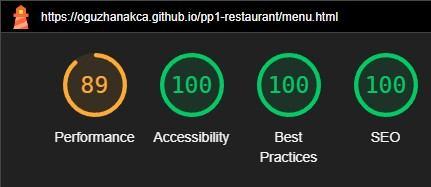

#### Desktop

Home

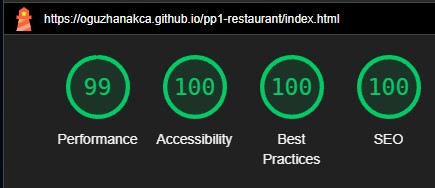

Gallery

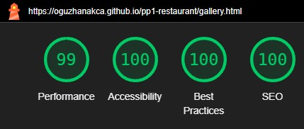

Contact

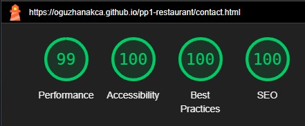

Menu

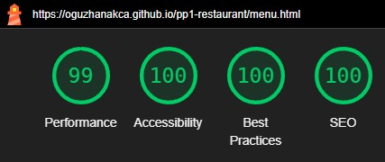

### Performing tests on various devices

The website was tested on the following devices:

- Desktop
- Iphone 6S
- Ipad 5th Gen

In addition, the website was tested using Google Chrome Developer Tools Device Toggeling option for all available device options.

### Browser compatability

The website was tested on the following browsers:

- Google Chrome
- Opera
- Microsoft Edge

### Testing user stories

#### As a first time user,

1.  I want to know more about restaurant.

| **Feature**   | **Action**               | **Expected Result**                                    | **Actual Result** |
| ------------- | ------------------------ | ------------------------------------------------------ | ----------------- |
| Image Gallery | Navigate to Gallery page | Finding images that gives information about restaurant | Works as expected |
| Homepage      | Navigate to Home page    | Find information about restaurant                      | Works as expected |

Screenshots

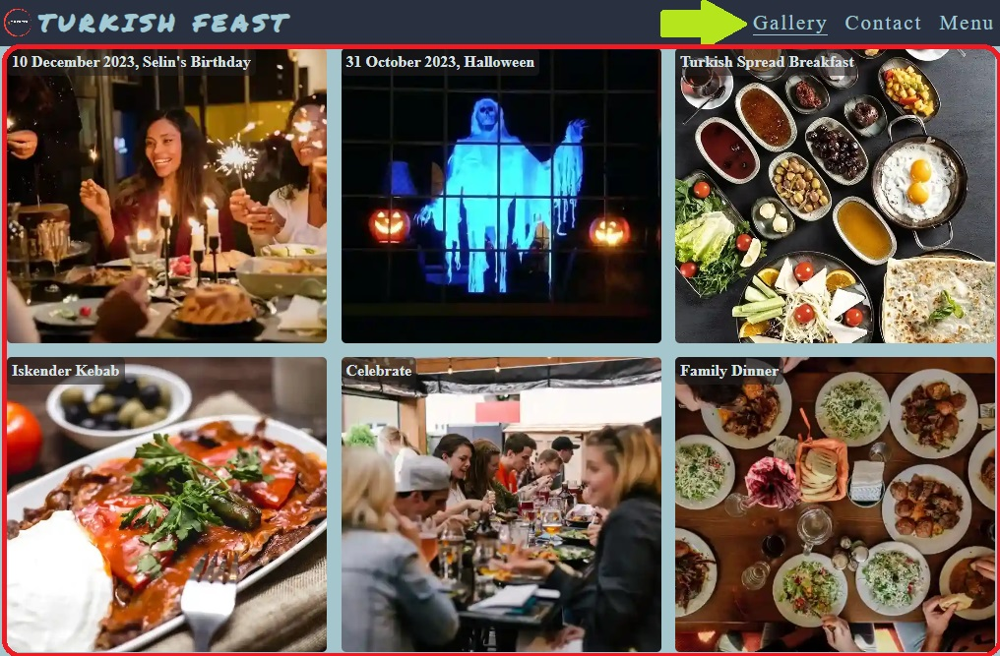
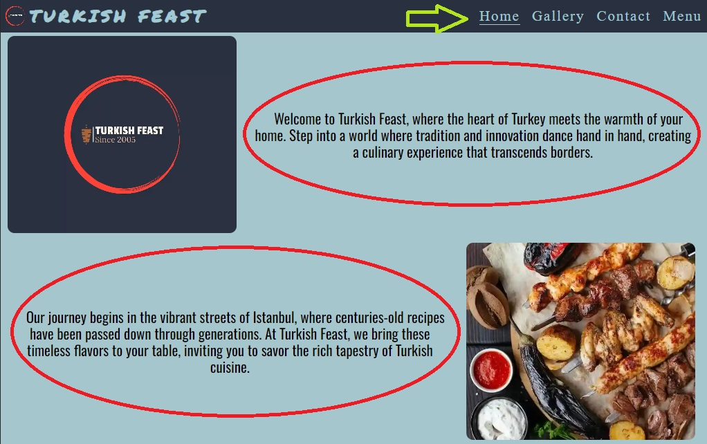

2. I want to know the menu and prices.

| **Feature** | **Action**                | **Expected Result**     | **Actual Result** |
| ----------- | ------------------------- | ----------------------- | ----------------- |
| Menu        | Navigate to the Menu page | See prices on menu page | Works as expected |

Screenshots

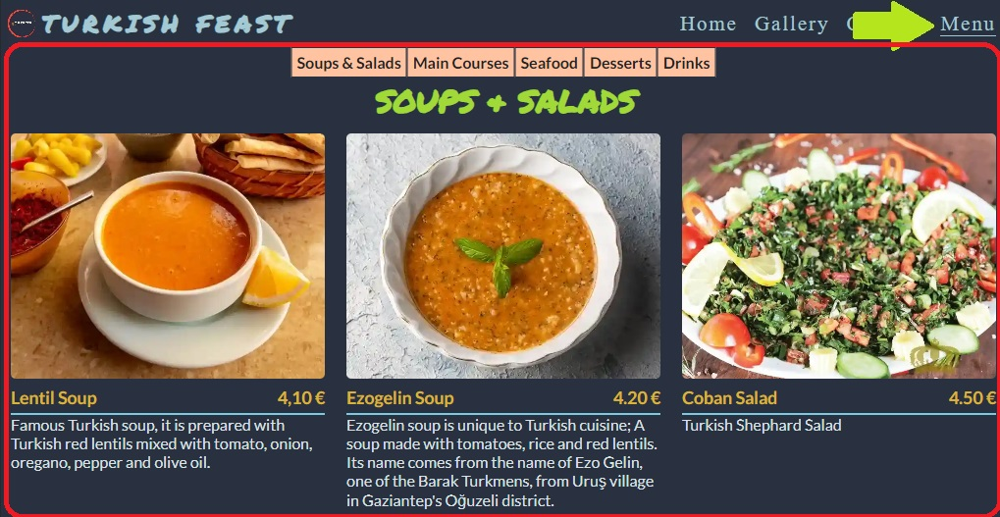

3. I want to be prepared what to expect at the restaurant.

| **Feature**   | **Action**               | **Expected Result**                  | **Actual Result** |
| ------------- | ------------------------ | ------------------------------------ | ----------------- |
| Image Gallery | Navigate to Gallery page | Find photos of restaurant and events | Works as expected |

Screenshots

4. I want to know where the restaurant located.

| **Feature** | **Action**               | **Expected Result**                                | **Actual Result** |
| ----------- | ------------------------ | -------------------------------------------------- | ----------------- |
| Map         | Navigate to Contact page | Find the map that shows the location of restaurant | Works as expected |

Screenshots

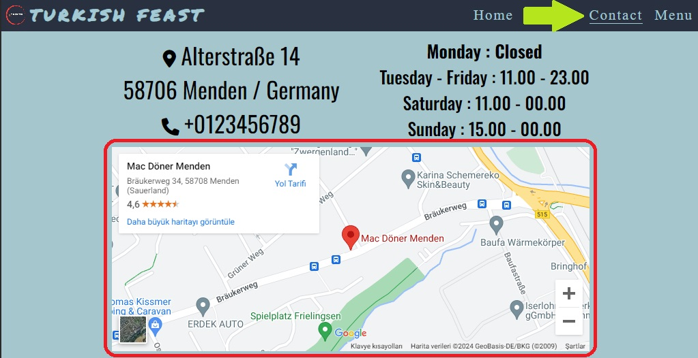

5. I want to know the contact address of restaurant.

| **Feature**         | **Action**               | **Expected Result**                    | **Actual Result** |
| ------------------- | ------------------------ | -------------------------------------- | ----------------- |
| Contact Information | Navigate to Contact Page | Find the contact address of restaurant | Works as expected |

Screenshots

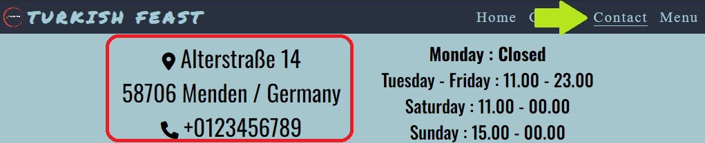

#### As a returning user,

6.  I want to see the menu.

| **Feature** | **Action**                | **Expected Result** | **Actual Result** |
| ----------- | ------------------------- | ------------------- | ----------------- |
| Menu        | Navigate to the Menu page | Find the menu       | Works as expected |

Screenshots

7. I want to know the working hours of the restaurant.

| **Feature**           | **Action**                               | **Expected Result**                             | **Actual Result** |
| --------------------- | ---------------------------------------- | ----------------------------------------------- | ----------------- |
| Working Hours         | Navigate to Contact Page                 | Find the working hours                          | Works as expected |
| Today's Working Hours | Check right side of footer on every page | Find out what time the restaurant is open today | Works as expected |

Screenshots

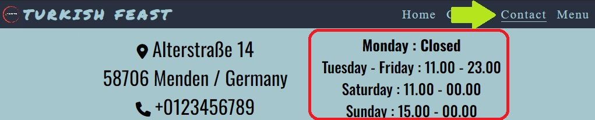
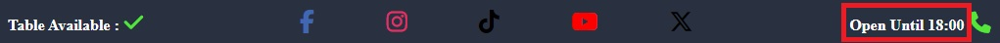

8. I want to find information if reservation is available.

| **Feature** | **Action**                                  | **Expected Result**                        | **Actual Result** |
| ----------- | ------------------------------------------- | ------------------------------------------ | ----------------- |
| Status      | Check the left side of footer on every page | Find out if there is reservation available | Works as expected |

Screenshots

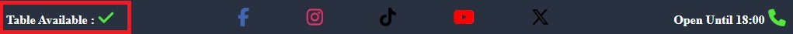

9. I want to find information if restaurant is open in that moment.

| **Feature**           | **Action**                               | **Expected Result**                             | **Actual Result** |
| --------------------- | ---------------------------------------- | ----------------------------------------------- | ----------------- |
| Today's Working Hours | Check right side of footer on every page | Find out what time the restaurant is open today | Works as expectd  |

Screenshots

10. I want to find a contact number to call for reservation.

| **Feature**         | **Action**                                                        | **Expected Result**                    | **Actual Result** |
| ------------------- | ----------------------------------------------------------------- | -------------------------------------- | ----------------- |
| Contact Information | Navigate to Contact Page                                          | Find the contact address of restaurant | Works as expected |
| Shortcut            | Click to Phone icon where its located on the right side of footer | Call for reservation                   | Works as expected |

Screenshots

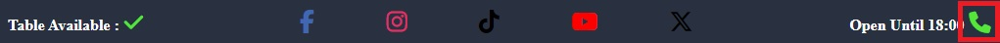

11. I want to find the social media accounts of restaurant.

| **Feature**           | **Action**                                       | **Expected Result**                   | **Actual Result** |
| --------------------- | ------------------------------------------------ | ------------------------------------- | ----------------- |
| Social Media Accounts | Check social media links in footer on every page | Find social media links of restaurant | Works as expected |

Screenshots

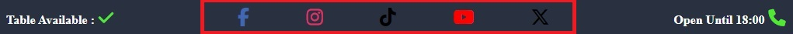

12. I want to find location of restaurant.

| **Feature** | **Action**               | **Expected Result**                                | **Actual Result** |
| ----------- | ------------------------ | -------------------------------------------------- | ----------------- |
| Map         | Navigate to Contact page | Find the map that shows the location of restaurant | Works as expected |

Screenshots

13. I want to leave suggestion or message to the staff.

| **Feature**  | **Action**                                        | **Expected Result**                      | **Actual Result** |
| ------------ | ------------------------------------------------- | ---------------------------------------- | ----------------- |
| Contact Form | Scroll down on contact page and find contact form | Leave suggestion or message to the staff | Works as expected |

Screenshots

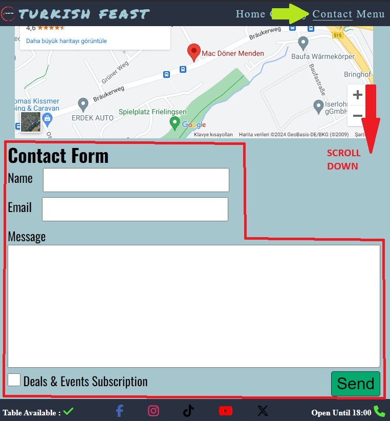

#### As the site owner,

14. I want the users to find information to contact us.

| **Feature**   | **Action**               | **Expected Result**                                    | **Actual Result** |
| ------------- | ------------------------ | ------------------------------------------------------ | ----------------- |
| Image Gallery | Navigate to Gallery page | Finding images that gives information about restaurant | Works as expected |
| Homepage      | Navigate to Home page    | Find information about restaurant                      | Works as expected |

Screenshots

15. I want users to find enough information about our business before they contact us.

| **Feature** | **Action**                                  | **Expected Result**                        | **Actual Result** |
| ----------- | ------------------------------------------- | ------------------------------------------ | ----------------- |
| Status      | Check the left side of footer on every page | Find out if there is reservation available | Works as expected |

Screenshots

16. I want users to see our menu.

| **Feature** | **Action**                | **Expected Result**     | **Actual Result** |
| ----------- | ------------------------- | ----------------------- | ----------------- |
| Menu        | Navigate to the Menu page | See prices on menu page | Works as expected |

Screenshots

17. I want users to see photos of events that we made in our restaurant.

| **Feature**   | **Action**               | **Expected Result**                                    | **Actual Result** |
| ------------- | ------------------------ | ------------------------------------------------------ | ----------------- |
| Image Gallery | Navigate to Gallery page | Finding images that gives information about restaurant | Works as expected |

Screenshots

## Deployment

The website was deployed using GitHub Pages by following these steps:

1. In the GitHub repository navigate to the Settings tab
2. On the left hand menu select Pages
3. For the source select Branch: main
4. After the webpage refreshes automaticaly you will se a ribbon on the top saying: "Your site is published at https://oguzhanakca.github.io/pp1-restaurant/"

You can for fork the repository by following these steps:

1. Go to the GitHub repository
2. Click on Fork button in upper right hand corner

You can clone the repository by following these steps:

1. Go to the GitHub repository
2. Locate the Code button above the list of files and click it
3. Select if you prefere to clone using HTTPS, SSH, or Github CLI and click the copy button to copy the URL to your clipboard
4. Open Git Bash
5. Change the current working directory to the one where you want the cloned directory
6. Type git clone and paste the URL from the clipboard ($ git clone https://github.com/YOUR-USERNAME/YOUR-REPOSITORY)
7. Press Enter to create your local clone.

## Acknowledgements

I would like to thank my mentor Mo Shami for his guidance and advices.
